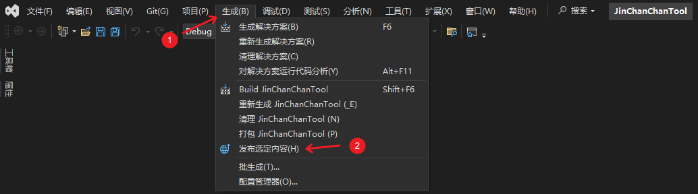
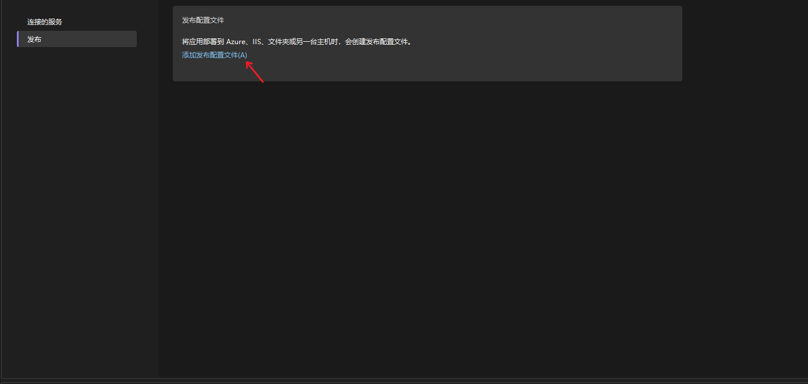
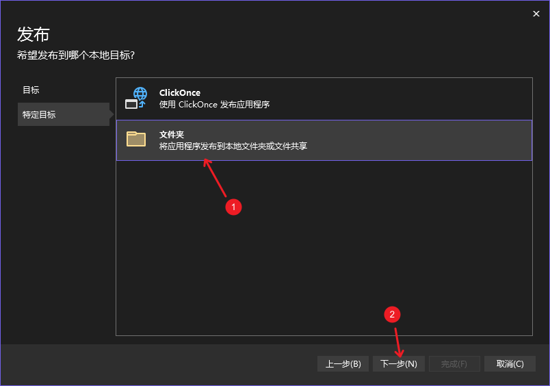
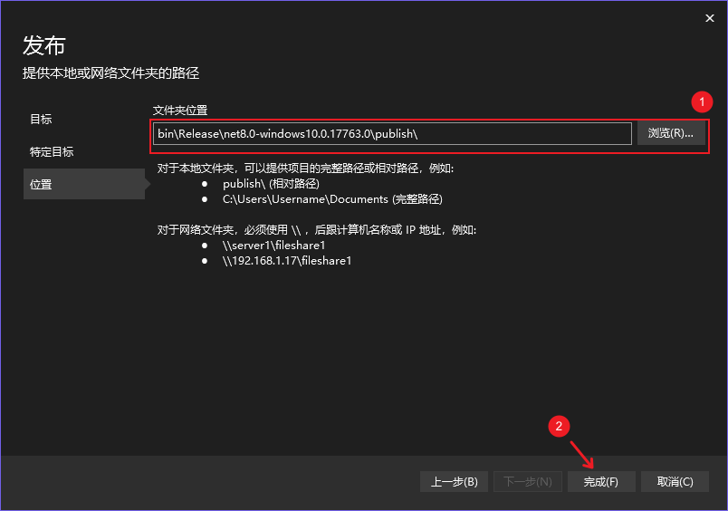
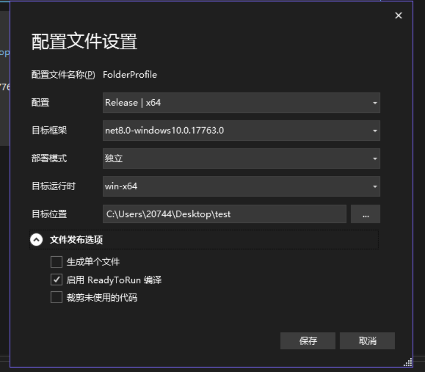
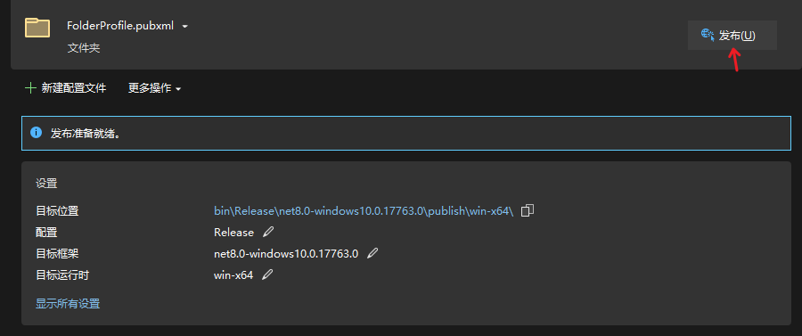
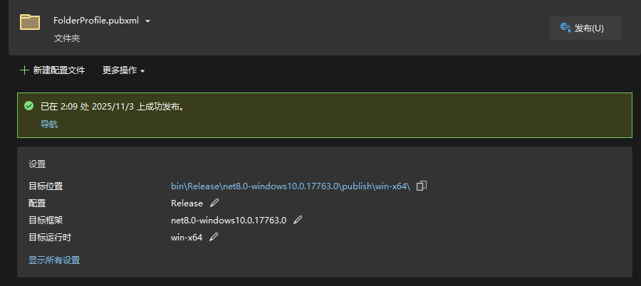
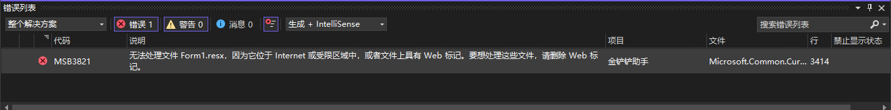
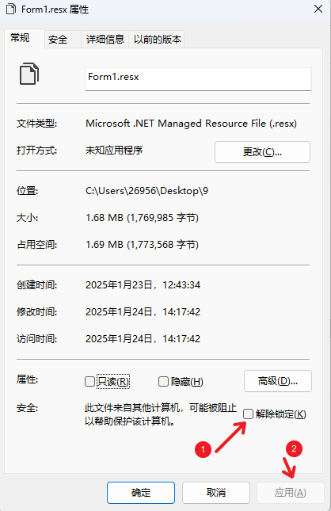

# 开发者文档

   1.1 [获取项目源码文件](#获取项目源码文件)

   1.2 [开发环境配置](#开发环境配置)

   1.3 [项目结构](#项目结构)

   1.4 [运行项目](#运行项目)

   1.5 [构建应用](#构建应用)

   1.6 [常见问题](#常见问题)

   1.7 [项目引用](#项目引用)


## 获取项目源码文件

### 方式1

1. 前往[Release 页面](https://github.com/XJYdemons/Jin-chan-chan-Tools/releases) 下载最新的源码`JinChanChanTool_vx.x.x_SourceCode.zip`。
2. 下载压缩包文件后，解压到一个目录中。

### 方式2

1. 项目-Code-DownLoad ZIP下载压缩包。
2. 解压后，源码文件存放于SourceCode文件夹中。


## 开发环境配置

* IDE：Visual Studio 2022
* 必需组件：
  * .NET 8.0 SDK
  * Windows SDK


## 项目结构

```
├── /JinChanChanTool                                    # 项目文件夹
	├── /bin                                            # 编译后的输出目录
	├── /obj                                            # 中间文件目录，包含编译时生成的临时文件
	├── /Properties                                     # 项目属性文件夹
		└── Resources.Designer.cs                       # 资源设计器生成代码
	├── /DataClass                                      # 数据模型类
		├── /StaticData                                 # 静态数据类
			├── JccCoordinateTemplates.cs               # 金铲铲位置坐标模版类
			└── TftCoordinateTemplates.cs               # 云顶之弈位置坐标模版类
		├── /GPUEnvironments                            # GPU环境相关数据类
			├── GpuInfo.cs                              # GPU信息类
			├── CudaInfo.cs                             # CUDA信息类
			└── RuntimeConfig.cs                        # 运行时配置类
		├── AutomaticSettings.cs                        # 自动应用配置数据类
		├── ManualSettings.cs                           # 用户应用配置数据类
		├── Hero.cs                                     # 英雄数据类
		├── Equipment.cs                                # 装备数据类
		├── LineUp.cs                                   # 阵容数据类（包含SubLineUp和LineUpUnit）
		├── RecommendedLineUp.cs                        # 推荐阵容数据类
		├── RecommendedEquipment.cs                     # 推荐装备数据类
		├── Profession.cs                               # 职业枚举类
		├── Peculiarity.cs                              # 特质枚举类
		├── MetatftLineupDtos.cs                        # 外部API数据传输对象类
		└── ResultMapping.cs                            # OCR结果映射类
	├── /DIYComponents                                  # 自定义UI组件
		├── HeroPictureBox.cs                           # 英雄图片框（支持选中状态）
		├── HeroAndEquipmentPictureBox.cs               # 英雄与装备组合图片框
		├── HeroAndEquipmentPictureBox.Designer.cs      # 设计器生成代码
		├── EquipmentToolTip.cs                         # 装备提示框
		├── EquipmentInformationToolTip.cs              # 装备信息提示框
		├── BenchPanel.cs                               # 备战席面板
		├── HexagonBoard.cs                             # 六边形棋盘
		├── HexagonCell.cs                              # 六边形单元格
		├── CapsuleSwitch.cs                            # 胶囊开关组件
		├── CustomPanel.cs                              # 自定义面板
		├── CustomFlowLayoutPanel.cs                    # 自定义流式布局面板
		└── RoundedButton.cs                            # 圆角按钮
	├── /Forms                                          # 窗体类
		├── /NecessaryForm                              # 核心窗体
			├── MainForm.cs                             # 主窗口
			├── MainForm.Designer.cs                    # 主窗口设计器代码
			├── SettingForm.cs                          # 设置窗口
			├── SettingForm.Designer.cs                 # 设置窗口设计器代码
			├── SetupWizardForm.cs                      # 首次运行设置向导
			├── SetupWizardForm.Designer.cs             # 设置向导设计器代码
			├── AboutForm.cs                            # 关于窗口
			└── AboutForm.Designer.cs                   # 关于窗口设计器代码
		├── /DisplayUIForm                              # 显示与覆盖窗体
			├── LineUpForm.cs                           # 阵容展示窗口
			├── LineUpForm.Designer.cs                  # 阵容展示窗口设计器代码
			├── LineUpSelectForm.cs                     # 阵容选择窗口
			├── LineUpSelectForm.Designer.cs            # 阵容选择窗口设计器代码
			├── EquipmentForm.cs                        # 装备推荐窗口
			├── EquipmentForm.Designer.cs               # 装备推荐窗口设计器代码
			├── CardHighlightOverlayForm.cs             # 卡牌高亮覆盖窗口
			├── CardHighlightOverlayForm.Designer.cs    # 卡牌高亮覆盖窗口设计器代码
			├── StatusOverlayForm.cs                    # 状态覆盖窗口
			├── StatusOverlayForm.Designer.cs           # 状态覆盖窗口设计器代码
			├── OutputForm.cs                           # 调试输出窗口
			├── OutputForm.Designer.cs                  # 调试输出窗口设计器代码
			├── SelectForm.cs                           # 通用选择窗口
			└── SelectForm.Designer.cs                  # 通用选择窗口设计器代码
		├── /ToolForm                                   # 工具与编辑器窗体
			├── HeroInfoEditorForm.cs                   # 英雄数据编辑器
			├── HeroInfoEditorForm.Designer.cs          # 英雄数据编辑器设计器代码
			├── EquipmentDataEditorForm.cs              # 装备数据编辑器
			├── EquipmentDataEditorForm.Designer.cs     # 装备数据编辑器设计器代码
			├── CorrectionEditorForm.cs                 # OCR纠正编辑器
			├── CorrectionEditorForm.Designer.cs        # OCR纠正编辑器设计器代码
			├── ProcessSelectorForm.cs                  # 进程选择窗口
			└── ProcessSelectorForm.Designer.cs         # 进程选择窗口设计器代码
		├── ProgressForm.cs                             # 进度条窗口
		└── ProgressForm.Designer.cs                    # 进度条窗口设计器代码
	├── /Services                                       # 业务逻辑服务类
		├── /DataServices                               # 数据管理服务
			├── /Interface                              # 服务接口
				├── IHeroDataService.cs                 # 英雄数据服务接口
				├── IEquipmentService.cs                # 装备数据服务接口
				├── ILineUpService.cs                   # 阵容数据服务接口
				├── IRecommendedLineUpService.cs        # 推荐阵容服务接口
				├── IManualSettingsService.cs           # 用户配置服务接口
				├── IAutomaticSettingsService.cs        # 自动配置服务接口
				└── ICorrectionService.cs               # OCR纠正服务接口
			├── HeroDataService.cs                      # 英雄数据服务类
			├── EquipmentService.cs                     # 装备数据服务类
			├── LineUpService.cs                        # 阵容数据服务类
			├── RecommendedLineUpService.cs             # 推荐阵容服务类
			├── ManualSettingsService.cs                # 用户配置服务类
			├── AutomaticSettingsService.cs             # 自动配置服务类
			└── CorrectionService.cs                    # OCR纠正服务类
		├── /AutomaticSetCoordinates                    # 自动坐标设置服务
			├── AutomationService.cs                    # 自动化编排服务类
			├── CoordinateCalculationService.cs         # 坐标计算服务类
			├── ProcessDiscoveryService.cs              # 进程发现服务类
			└── WindowInteractionService.cs             # 窗口交互服务类
		├── /ManuallySetCoordinates                     # 手动坐标设置服务
			└── FastSettingPositionService.cs           # 快速坐标设置服务类
		├── /RecommendedEquipment                       # 装备推荐服务
			├── /Interface                              # 服务接口
				└── IHeroEquipmentDataService.cs        # 英雄装备数据服务接口
			├── HeroEquipmentDataService.cs             # 英雄装备数据服务类
			├── CrawlingService.cs                      # 爬虫服务类
			├── DynamicGameDataService.cs               # 动态游戏数据服务类
			├── TranslationModels.cs                    # 翻译模型类
			└── UnitDetailModels.cs                     # 单位详情模型类
		├── /LineupCrawling                             # 阵容爬取服务
			└── LineupCrawlingService.cs                # 阵容爬取服务类
		├── /Network                                    # 网络通信服务
			├── HttpProvider.cs                         # HTTP客户端提供者
			└── SignatureHelper.cs                      # 请求签名助手
		├── /GPUEnvironments                            # GPU环境服务
			├── GpuDetectionService.cs                  # GPU检测服务类
			├── CudaDetectionService.cs                 # CUDA检测服务类
			├── CudaInstallerService.cs                 # CUDA安装服务类
			├── CudnnInstallerService.cs                # cuDNN安装服务类
			├── RuntimeDeployService.cs                 # 运行时部署服务类
			└── DownloadService.cs                      # 下载服务类
		├── CardService.cs                              # 卡牌自动化服务类（拿牌、高亮、刷新）
		├── QueuedOCRService.cs                         # 队列OCR服务类（支持CPU/GPU）
		└── UIBuilderService.cs                         # UI构建服务类
	├── /Tools                                          # 工具类
		├── /KeyBoardTools                              # 键盘工具
			├── GlobalHotkeyTool.cs                     # 全局热键工具类
			└── KeyboardControlTool.cs                  # 键盘控制工具类
		├── /MouseTools                                 # 鼠标工具
			├── MouseControlTool.cs                     # 鼠标控制工具类
			├── MouseHookTool.cs                        # 鼠标钩子工具类
			└── MousePositionTool.cs                    # 鼠标位置工具类
		├── /LineUpCodeTools                            # 阵容码工具
			└── LineUpParser.cs                         # 阵容码解析器
		├── LogTool.cs                                  # 日志工具类
		├── ImageProcessingTool.cs                      # 图像处理工具类
		├── DragHelper.cs                               # 拖拽助手类
		└── ColorJsonConverter.cs                       # 颜色JSON转换器
	├── /Resources                                      # 资源目录
		├── /HeroDatas                                  # 游戏数据目录
			├── /强音对决                               # 金铲铲游戏模式数据
				├── HeroData.json                       # 英雄数据
				├── LineUps.json                        # 阵容模板
				└── /images                             # 英雄头像图片
			└── /英雄联盟传奇                           # 云顶之弈游戏模式数据
				├── HeroData.json                       # 英雄数据
				├── Equipment.json                      # 装备数据
				├── EquipmentData.json                  # 装备详情数据
				├── LineUps.json                        # 阵容模板
				├── RecommendedLineUps.json             # 推荐阵容
				├── /images                             # 英雄头像图片
				└── /EquipmentImages                    # 装备图标图片
		├── /Models                                     # OCR模型目录
			├── /PP-OCRv5_mobile_det_infer              # 文本检测模型
			├── /PP-OCRv5_mobile_rec_infer              # 文本识别模型
			└── ppocr_keys_v5.txt                       # OCR字符字典
		├── CorrectionsList.json                        # OCR结果纠正映射文件
		├── DownloadSources.json                        # 下载源配置文件
		├── defaultHeroIcon.png                         # 默认英雄图标
		└── icon.ico                                    # 应用程序图标
	├── app.manifest                                    # 应用配置清单文件
	├── JinChanChanTool.csproj                          # 项目文件
	├── JinChanChanTool.csproj.user                     # 用户特定的项目配置文件
	└── Program.cs                                      # 应用程序入口点
└── JinChanChanTool.sln                                 # 解决方案文件，可通过VisualStudio打开
```

## 项目架构说明

### 核心功能模块

#### 1. OCR识别系统
- **引擎**: PaddleOCR v5
- **支持模式**: CPU推理 / GPU推理（CUDA加速）
- **功能**: 识别游戏内英雄卡牌名称
- **优化**: 队列化处理、结果纠正映射

#### 2. 自动化系统
- **卡牌拾取**: 基于OCR识别结果自动点击目标英雄
- **商店刷新**: 自动刷新商店并重新识别
- **高亮显示**: 覆盖窗口高亮推荐英雄
- **状态反馈**: 实时显示自动化状态

#### 3. 数据管理系统
- **多赛季支持**: 支持不同游戏赛季的数据切换
- **英雄数据**: 英雄名称、费用、职业、特质、图标
- **装备数据**: 装备名称、类型、合成路径、图标
- **阵容数据**: 早期/中期/后期阵容变体、装备推荐
- **推荐系统**: 从外部API获取推荐阵容和装备

#### 4. 坐标系统
- **自动检测**: 自动识别游戏窗口并计算坐标
- **手动设置**: 支持手动快速设置关键坐标
- **模板系统**: 预设坐标模板（金铲铲/云顶之弈）

#### 5. GPU加速支持
- **GPU检测**: 自动检测NVIDIA GPU和CUDA支持
- **运行时部署**: 自动下载和部署CUDA/cuDNN运行时
- **性能优化**: GPU推理显著提升OCR识别速度

### 设计模式

- **依赖注入**: 服务通过构造函数注入到窗体
- **服务层模式**: 业务逻辑与UI分离
- **接口抽象**: 服务实现接口以支持扩展
- **单例模式**: 部分服务（如OutputForm）使用单例
- **观察者模式**: 基于事件的状态更新

### 数据流程

1. **启动流程**:
   ```
   Program.cs → 初始化服务 → 首次运行向导（可选）→ 主窗口
   ```

2. **OCR识别流程**:
   ```
   截图 → QueuedOCRService → PaddleOCR → 结果纠正 → 返回识别结果
   ```

3. **自动拾取流程**:
   ```
   热键触发 → CardService → OCR识别 → 匹配阵容 → 模拟点击
   ```

4. **数据加载流程**:
   ```
   选择赛季 → 加载对应JSON文件 → 反序列化为数据对象 → 更新UI
   ```

## 技术栈

### 开发环境
- **IDE**: Visual Studio 2022
- **框架**: .NET 8.0 (Windows 10.0.17763.0+)
- **平台**: Windows x64
- **UI框架**: WinForms

### 主要依赖包
- **Newtonsoft.Json** (13.0.3) - JSON序列化/反序列化
- **OpenCvSharp4** (4.11.0) - 图像处理
- **Sdcb.PaddleInference** (3.0.1) - OCR推理引擎
- **Sdcb.PaddleOCR** (3.0.1) - OCR封装库
- **System.Drawing.Common** (9.0.9) - 图形绘制
- **System.Management** (9.0.0) - 进程管理

### OCR模型
- **检测模型**: PP-OCRv5_mobile_det_infer
- **识别模型**: PP-OCRv5_mobile_rec_infer
- **字符字典**: ppocr_keys_v5.txt

## 运行项目

1. 使用 Visual Studio 打开` JinChanChanTool.sln `文件。

2. 选择`Debug-X64`模式，如图：


3. 点击运行，如图：

    

## 构建应用

1. 使用 Visual Studio 打开`JinChanChanTool.sln` 文件。
2. 菜单项-生成-发布选定内容



3. 点击**添加发布配置文件**



4. 选择“文件夹”，下一步


5. 选择“文件夹”，下一步

   

6. 选择发布路径，点击完成。



7. 点击“显示所有设置”，将设置项修改为与下图一致：
   * 配置：Release|x64
   * 目标框架：net8.0-windows10.0.17763.0
   * 部署模式：独立
   * 目标运行时：win-x64
   * 目标位置：自定义发布位置
   * 生成单个文件❎
   * 启用ReadyToRun编译✅
   * 裁剪未使用的代码❎

   

8. 点击“发布”按钮。

   

9. 关注提示信息，若发布成功，会提示成功发布。

   

## 常见问题

**问题1：** 运行或生成解决方案时报错：无法处理文件 Form1.resx，因为它位于 Internet 或受限区域中，或者文件上具有 Web 标记。要想处理这些文件，请删除 Web 标记。如图：



**解决：**

1. 先关闭VisualStudio。
2. 来到项目根目录，找到文件“Form1.resx”，右键菜单-属性。
3. 在下方“安全”-“此文件来自其他计算机，可能被阻止以帮助保护该计算机”处，勾选“解除锁定”，并点击应用按钮。如图：



4. 再次用VisualStudio打开`JinChanChanTool.sln`文件。


## 项目引用

### OCR相关
* [Paddle OCR Sharp](https://github.com/raoyutian/PaddleOCRSharp) - PaddleOCR的C#封装
* [PaddleSharp](https://github.com/sdcb/PaddleSharp) - Paddle推理引擎的.NET封装

### 图像处理
* [OpenCvSharp](https://github.com/shimat/opencvsharp) - OpenCV的.NET封装

### 其他依赖
* [Newtonsoft.Json](https://www.newtonsoft.com/json) - JSON处理库

## 开发指南

### 添加新赛季数据

1. 在 `Resources/HeroDatas/` 下创建新赛季文件夹
2. 添加以下文件:
   - `HeroData.json` - 英雄数据
   - `Equipment.json` / `EquipmentData.json` - 装备数据
   - `LineUps.json` - 阵容模板
   - `RecommendedLineUps.json` - 推荐阵容
   - `images/` - 英雄头像图片文件夹
   - `EquipmentImages/` - 装备图标图片文件夹

### 添加新的自定义组件

1. 在 `DIYComponents/` 文件夹下创建新的类文件
2. 继承自相应的WinForms控件基类
3. 重写 `OnPaint` 方法实现自定义绘制
4. 在 `MainForm` 或其他窗体中使用

### 添加新的服务

1. 在 `Services/` 对应子文件夹下创建服务类
2. 在 `Services/*/Interface/` 下创建对应接口
3. 在 `Program.cs` 中注册服务实例
4. 通过构造函数注入到需要使用的窗体

### 调试技巧

1. **查看OCR识别结果**: 使用 `OutputForm` 查看实时日志
2. **测试坐标设置**: 使用手动设置模式验证坐标准确性
3. **GPU调试**: 检查 `AutomaticSettings.json` 中的GPU配置
4. **数据验证**: 使用内置的数据编辑器验证JSON数据格式

### 代码规范

- 使用中文注释说明关键逻辑
- 服务类使用依赖注入模式
- 数据类使用属性而非字段
- 异步操作使用 `async/await` 模式
- 资源释放实现 `IDisposable` 接口

