# 第2章 开始使用

## 启动软件

以管理员权限运行`JinChanChanTool.exe`。

## 首次使用

首次启动软件后，会弹出一个配置向导窗口，帮助用户快速配置必要设置。
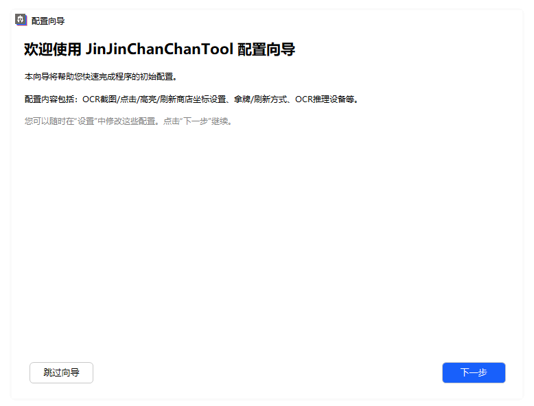

建议对设置项不熟练的用户使用本配置向导进行程序设置。

点击 “跳过向导”可以关闭该配置向导直接进入程序主窗口。

### 设置坐标

在配置向导的欢迎页面单击 “下一步”，跳转到选择坐标设置模式页。

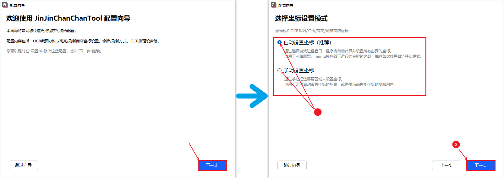

勾选坐标设置模式单选框后，单击 “下一步”，进入自动设置坐标页或手动设置坐标页：

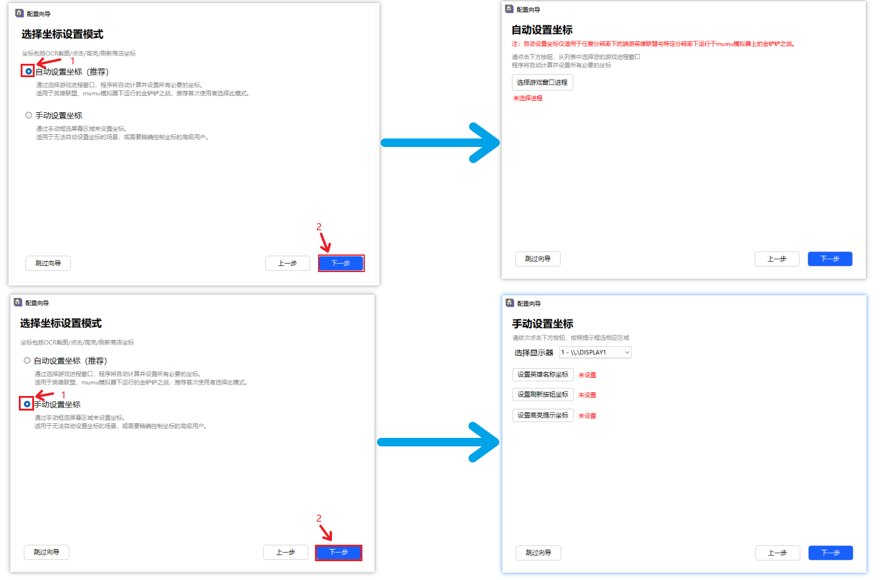

* 自动设置坐标：点击“选择游戏窗口进程”，打开进程选择窗口，选中游戏窗口进程，点击“选定此进程”，
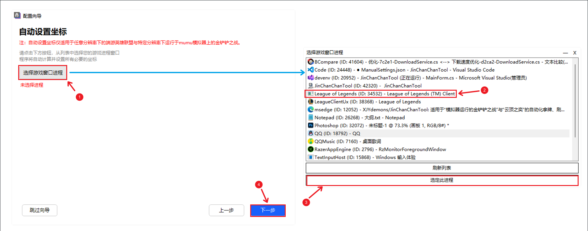

* 手动设置坐标：通过显示器下拉框选择游戏窗口所在显示器，依次点击”设置英雄名称坐标“、”设置刷新按钮坐标“、”设置高亮提示坐标“：
  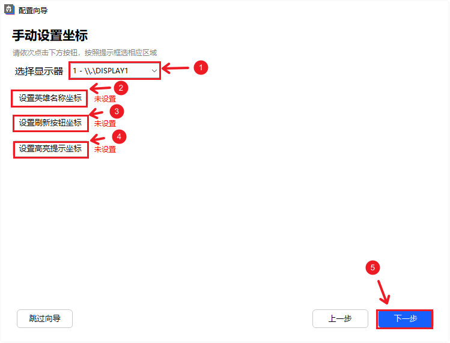
  * 设置英雄名称坐标：要求依次框选商店5个英雄卡的名称部分（不包括金币图标）
     
  * 设置刷新按钮坐标：要求完全框选刷新按钮
   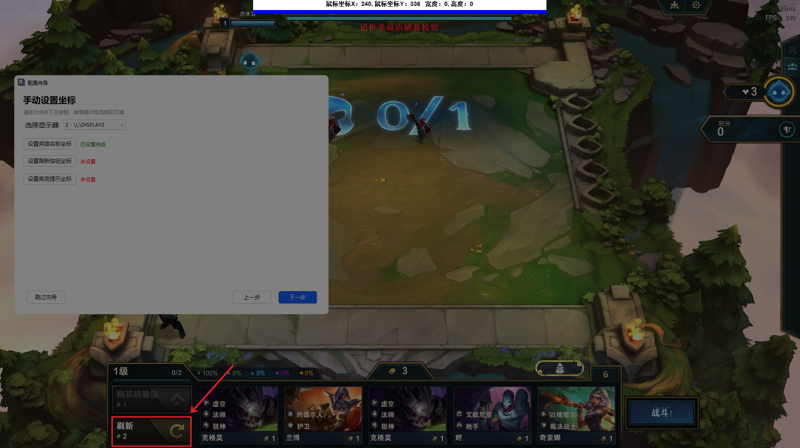
  * 设置高亮提示坐标：要求依次框选商店5个英雄卡的所有部分（包括图片、名称部分）
   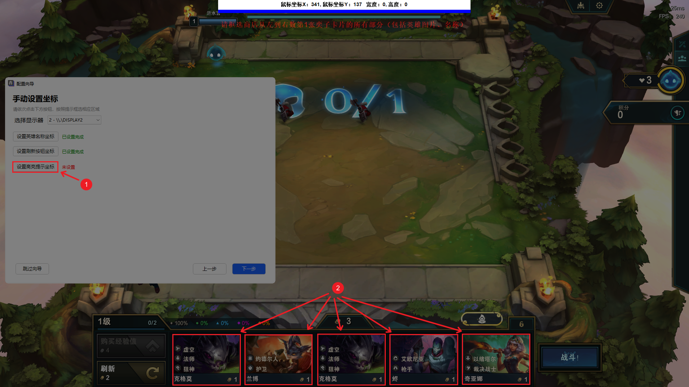

### 设置拿牌方式

坐标设置完成后，将跳转到 “选择拿牌方式” 页

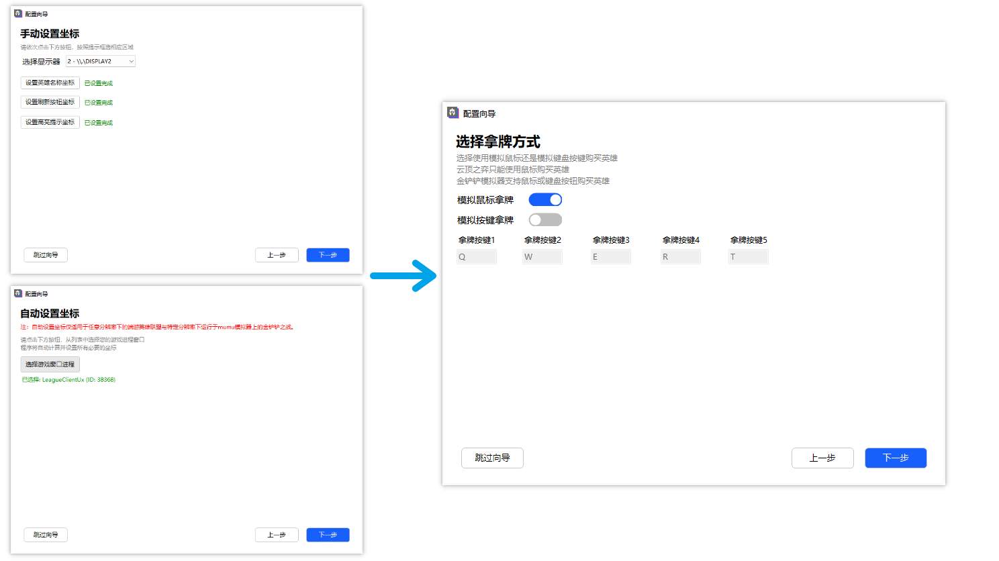

* 模拟鼠标拿牌：使用WinAPI模拟鼠标光标移动点击进行拿牌。
* 模拟按键拿牌：使用WinAPI模拟键盘按键触发进行拿牌。（仅适用于模拟器）

### 设置刷新商店方式

拿牌方式设置完成后，将跳转到 “选择刷新商店方式” 页

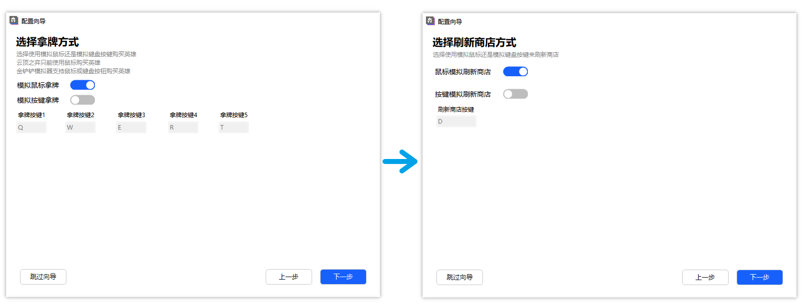

* 模拟鼠标刷新商店：使用WinAPI模拟鼠标光标移动点击刷新商店。
* 模拟按键刷新商店：使用WinAPI模拟键盘按键触发刷新商店。

### 设置OCR推理设备

刷新商店方式设置完成后，将跳转到 “选择OCR推理设备” 页

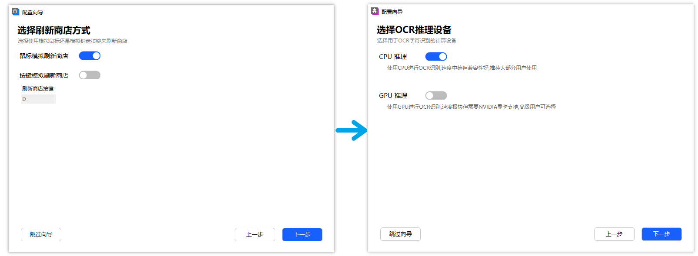

* 选择CPU推理后，将直接可以使用。

* 选择GPU推理后，将进入GPU推理环境配置页：
  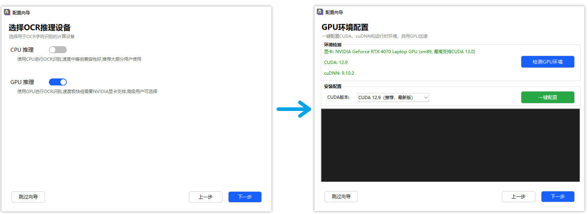
  * 依次点击 “检测GPU环境”、CUDA版本选择下拉框（一般选择推荐项即可）、“一键配置”。

### 配置完成

推理设备设置完成后会显示配置摘要，如发现不符预期的配置，可以通过上一步返回到目标位置进行修改。

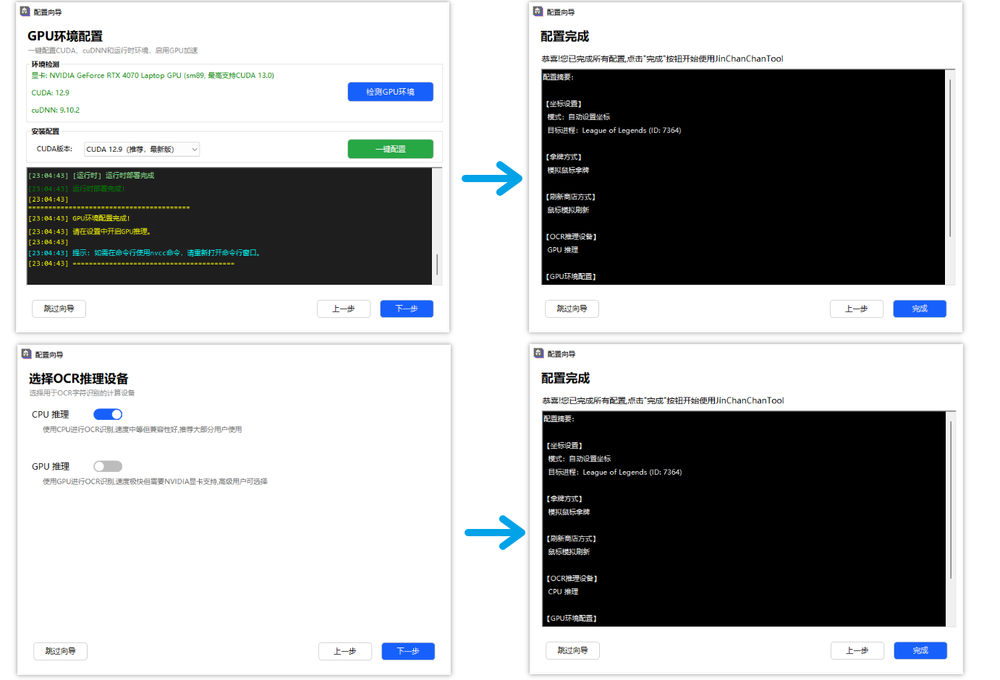

配置摘要检查完毕后，点击 “完成” 即可进入程序主窗口。（部分配置修改会提示重启程序以使配置生效）

## 备用的必要设置配置方法

若意外关闭或跳过配置向导页面，可通过菜单栏-帮助-配置向导重新打开配置向导。
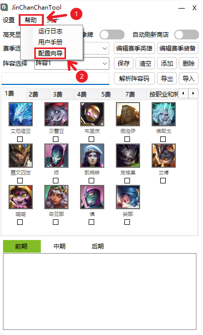

如果不希望通过配置向导进行设置配置，也可以前往菜单栏-设置，打开设置窗口进行设置配置。
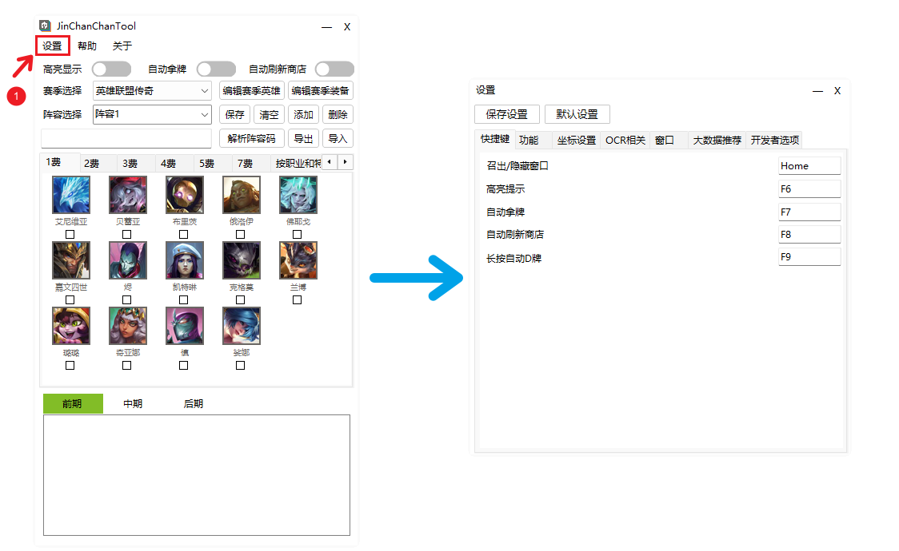

以下是设置窗口中必要设置所在位置：

1. 坐标设置：设置窗口-坐标设置
    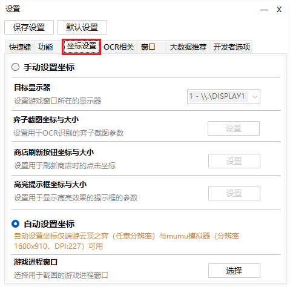
2. 拿牌方式：设置窗口-功能-自动拿牌-拿牌方式
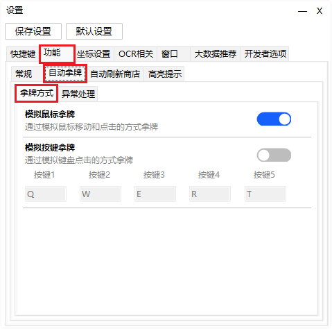

3. 刷新商店方式：设置-功能-自动刷新商店-刷新方式
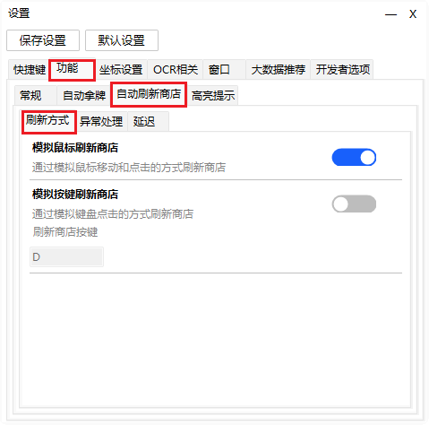

4. 选择OCR设备：设置-OCR相关-OCR设备
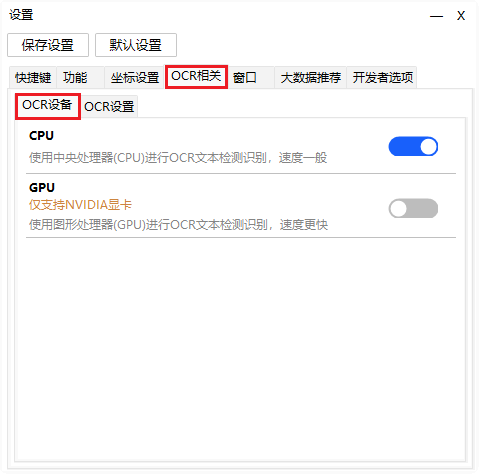

5. GPU推理环境配置：GPU推理环境配置目前必须在配置向导中进行设置。

## 功能使用

### 高亮显示

开启高亮显示后，会用高亮边框框选已选择的目标英雄：

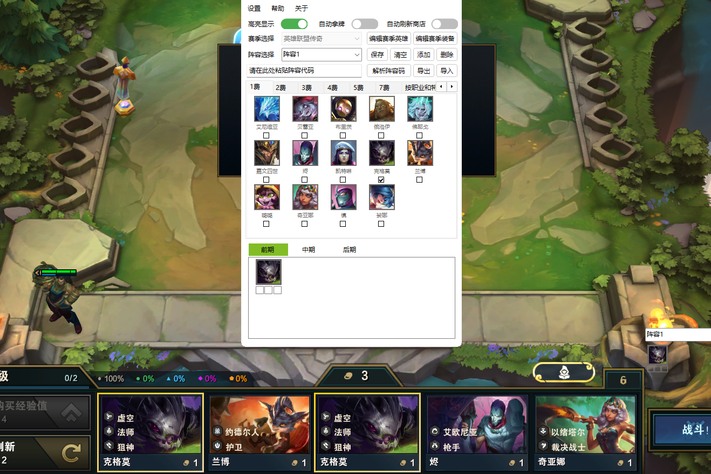

## 自动拿牌

开启自动拿牌后，会用指定的拿牌方式购买商店中的目标英雄（如果有）。

## 自动刷新商店

自动刷新商店，配合自动拿牌功能使用。

