# 第3章 界面介绍

## 主窗口

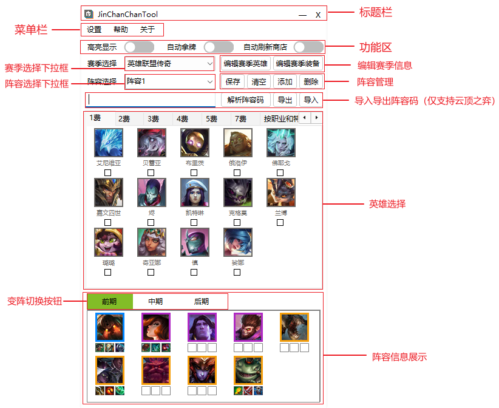

### 标题栏

* “—”按钮：最小化主窗口。
* “x”按钮：关闭程序。

### 菜单栏

* 设置：打开设置窗口
* 帮助
  * 运行日志：打开程序本次运行的日志文件。
  * 用户手册：打开用户帮助手册。
  * 配置向导：打开初次使用时弹出的配置向导页面。
* 关于：打开关于窗口。

### 功能区

* 高亮显示切换开关：切换高亮显示功能的开关，绿色则表示开启、灰色则表示关闭。
* 自动拿牌切换开关：切换自动拿牌功能的开关，绿色则表示开启、灰色则表示关闭。
* 自动刷新商店切换开关：切换自动刷新商店功能的开关，绿色则表示开启、灰色则表示关闭。

### 赛季相关

* 赛季选择下拉框：切换不同赛季英雄。
* 编辑赛季英雄：打开赛季英雄配置文件编辑器，编辑赛季英雄。
* 编辑赛季装备：打开赛季装备配置文件编辑器，编辑赛季装备。

### 阵容相关

* 阵容选择下拉框：在已有阵容中进行切换。
* 保存：保存当前阵容到本地文件。
* 清空：清空当前阵容的所有已选择英雄。
* 添加：新建一个空阵容，并选择。
* 删除：删除当前选中阵容。

### 阵容码相关

* 阵容码输入框：用于输入需要解析的阵容码，或用于展示导出的阵容码。
* 解析阵容码：将阵容码输入框中的阵容码解析，并自动勾选阵容码中的英雄到当前选择阵容。
* 导出：将当前选择阵容导出为阵容码，复制到剪切板并展示在阵容码输入框中。
* 导入：将当前剪切板的内容作为阵容码解析，并自动勾选阵容码中的英雄到当前选择阵容。

### 英雄选择

* 费用选项卡：通过切换费用选项卡，来选择不同费用的英雄。
  * 每个费用选项卡下都有若干个相同费用的英雄，点击头像或头像底部的复选框即可切换勾选状态。
* 按职业和特质选择选项卡：通过职业与特质批量勾选英雄。

### 阵容信息展示

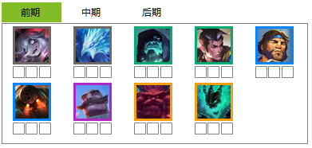

* 变阵按钮：
  * 鼠标左键可选择变阵按钮，来切换当前阵容的变阵。
  * 鼠标右键可以命名变阵。
  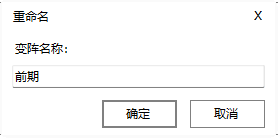
* 展示的英雄
  * 左键单击展示英雄的头像可以取消勾选该英雄。
  * 每个展示英雄头像下方有三个装备槽位，单击槽位可以为该槽位选择展示的装备。
  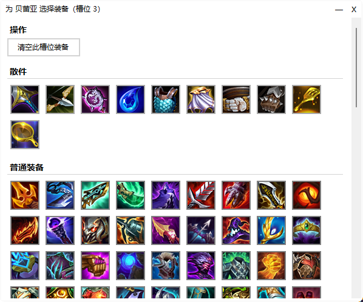

## 状态面板

通过菜单栏-设置-窗口-状态窗口-启用状态面板（开）来启用状态面板
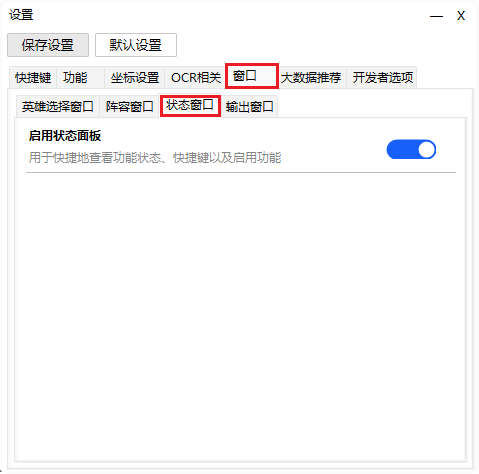

状态面板：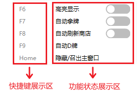

* 快捷键展示区：展示各个功能的快捷键。
* 功能状态展示区：展示各个功能的开启状态。
* 通过鼠标左键拖动状态面板的任意区域可以整体拖动状态面板。

## 英雄选择面板
通过菜单栏-设置-窗口-英雄选择窗口-启用英雄选择面板（开）来启用英雄选择面板
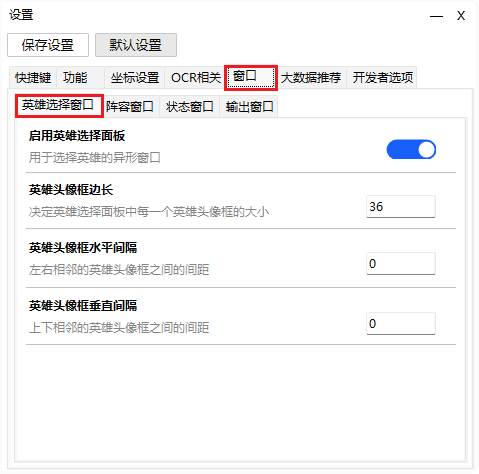

英雄选择面板：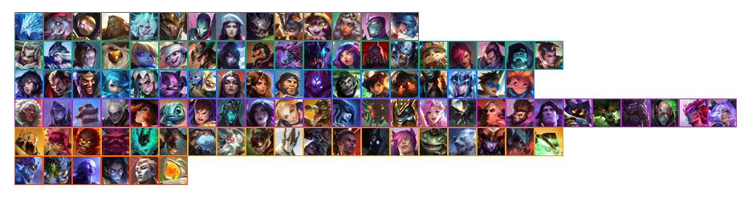

* 通过鼠标左键单击英雄头像可以切换该英雄的勾选状态。

* 通过鼠标左键拖动任意英雄头像可以整体拖动英雄选择面板。

## 阵容面板

通过菜单栏-设置-窗口-阵容窗口-启用阵容面板（开）来启用阵容面板。
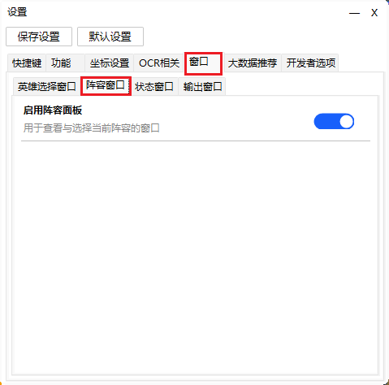

阵容面板：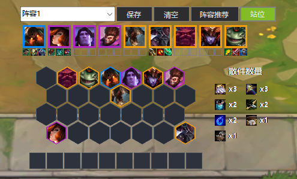

### 按钮区域

* 阵容选择下拉框：在已有阵容中进行切换。
* 保存按钮：保存当前阵容到本地文件。
* 清空按钮：清空当前阵容的所有已选择英雄。
* 阵容推荐按钮：打开推荐阵容选择窗口，用于一键应用从大数据获取的阵容。
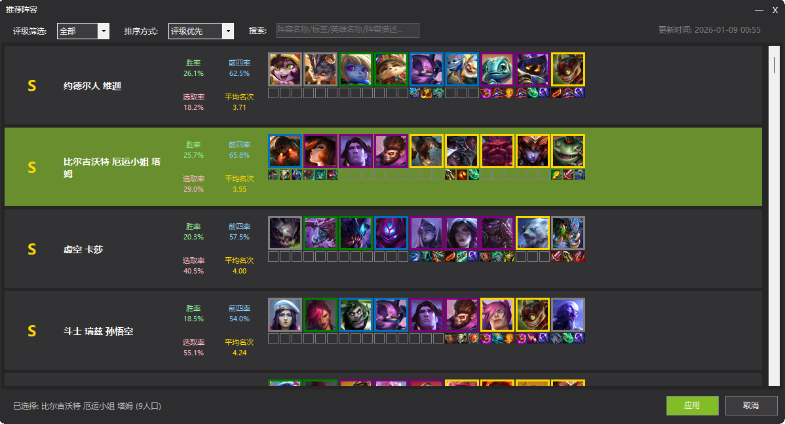
* 站位按钮：展开/收起站位与散件数量显示。
* 通过鼠标左键拖动任意按钮可以整体拖动阵容面板。

### 阵容展示区域

* 展示的英雄
  * 左键单击展示英雄的头像可以取消勾选该英雄。
  * 每个展示英雄头像下方有三个装备槽位，单击槽位可以为该槽位选择展示的装备。
  
* 站位：站位区域分为棋盘与备战席，弈子可以在棋盘和备战席之间反复拖动。
* 散件数量：展示阵容中所需的所有散件数量，从上到下从左到右按降序排列。
* 通过鼠标左键拖动任意英雄头像可以整体拖动阵容面板。

## 输出窗口

通过菜单栏-设置-窗口-输出窗口-启用输出窗口（开）来启用输出窗口。
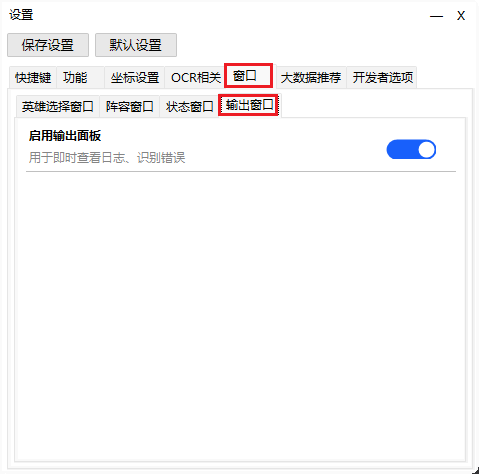

输出窗口：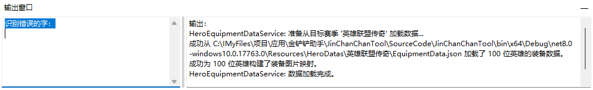

* 识别错误展示区（左侧）：若OCR识别到的字符不属于任意英雄的名称，则判定该字符识别错误，将展示在此处。
* 输出信息区（右侧）：显示每一轮的识别结果与其他的程序输出信息，用于调试。

