# 第5章 使用GPU推理COR

在使用本程序“JinChanChanTool”的GPU推理功能（利用GPU进行OCR识别而非CPU，速度加快，占用变低），请确保你的计算机满足以下条件（任意一项未满足都可能导致无法使用GPU推理功能）：

## 系统要求

1. Windows10或以上。

## 硬件要求

1. 内存>=16GB
2. 显示器适配器（GPU）的品牌必须英伟达，且满足以下型号中的任意一种：
   1. GTX10xx系（例如GTX1060）
   2. GTX16xx系（例如GTX1660Super）
   3. RTX20xx系（例如RTX2060）
   4. RTX30xx系（例如RTX3060）
   5. RTX40xx系（例如RTX4060）
   6. RTX50xx系（例如RTX5060）

## 已安装环境

1. 已安装[DOTNET 8.0 桌面运行时](https://dotnet.microsoft.com/zh-cn/download/dotnet/thank-you/runtime-desktop-8.0.19-windows-x64-installer)
2. 满足条件的[英伟达显卡驱动](https://www.nvidia.cn/geforce/drivers/)(版本>=520.06)
3. 满足条件的[CUDA](https://developer.nvidia.com/cuda-toolkit-archive)（版本>=11.8.0且<=13.0.0，推荐[CUDA 11.8](https://developer.nvidia.com/cuda-11-8-0-download-archive)或[CUDA 12.6](https://developer.nvidia.com/cuda-12-6-0-download-archive)或[CUDA 12.9](https://developer.nvidia.com/cuda-12-9-0-download-archive)）
4. 满足条件的[cuDNN](https://developer.download.nvidia.com/compute/cudnn/redist/cudnn/windows-x86_64/)（版本与安装的CUDA版本需适配，例如CUDA 11.8=>[cudnn-8.9.7-cuda11](https://developer.nvidia.com/downloads/compute/cudnn/secure/8.9.7/local_installers/11.x/cudnn-windows-x86_64-8.9.7.29_cuda11-archive.zip/),CUDA 12.6=>[cudnn-9.5.0-cuda12](https://developer.download.nvidia.com/compute/cudnn/redist/cudnn/windows-x86_64/cudnn-windows-x86_64-9.5.0.50_cuda12-archive.zip),CUDA 12.9=>[cudnn-9.10-cuda12](https://developer.download.nvidia.com/compute/cudnn/redist/cudnn/windows-x86_64/cudnn-windows-x86_64-9.10.0.56_cuda12-archive.zip)）

如果你不确定自己有没有安装满足要求的环境，请参考以下指引安装：

### 1.DotNet运行时

当电脑没有安装DotNet运行时，系统会弹出一个窗口指引你安装。

### 2.显卡驱动自查

右下角任务栏托盘一般能找到这个图标的软件，这就是NVIDIA控制面板（若任务栏没有，请搜索已安装的应用NVIDIA Control Panel），打开该软件。


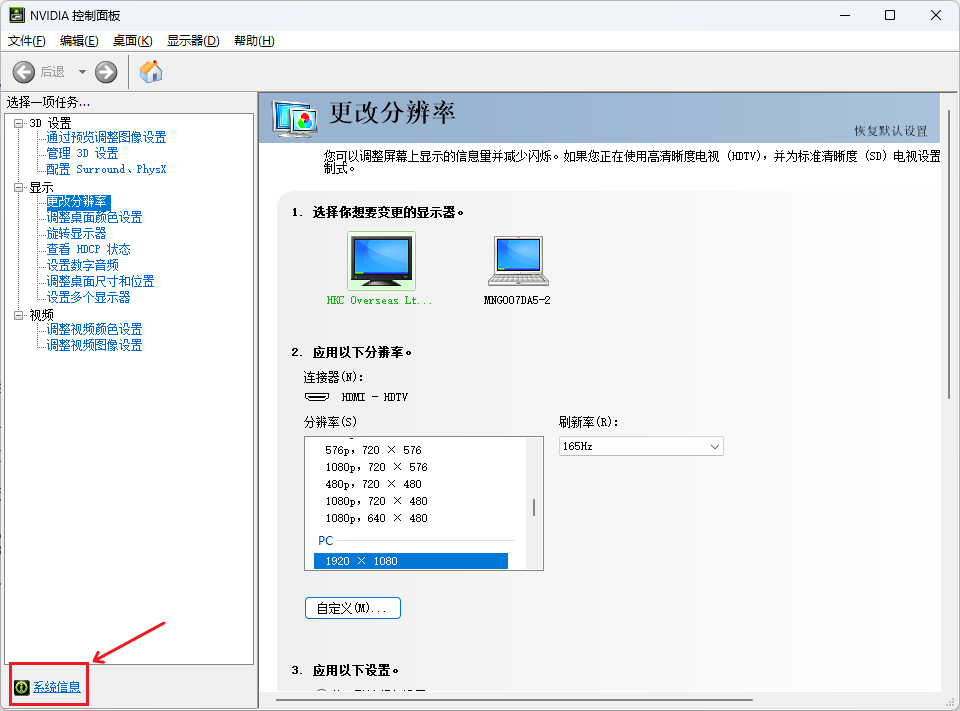

点击左下角的系统信息

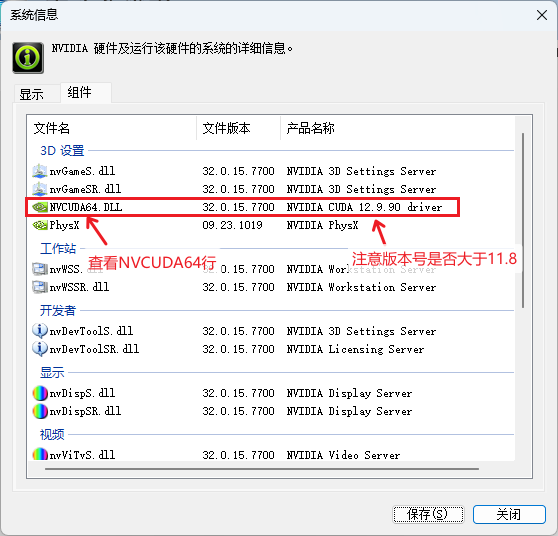

打开后点击”组件“，在行”NVCUDA64“的产品名称列，找到支持的最高CUDA版本，若小于11.8，则应更新英伟达显卡驱动到版本>=520.06。

英伟达显卡驱动下载地址：https://www.nvidia.cn/geforce/drivers/


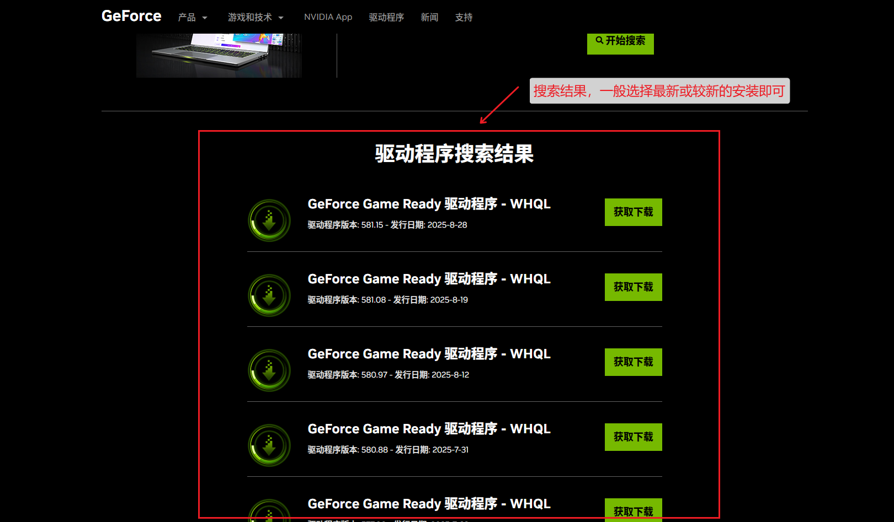

下载完成后打开安装程序：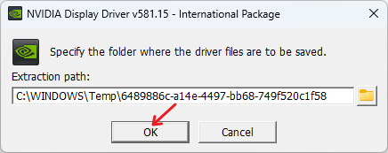

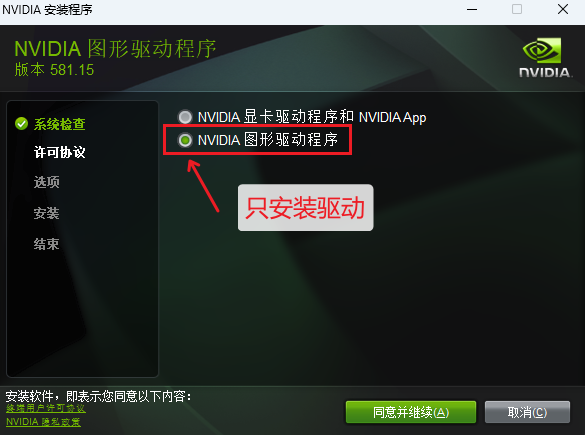

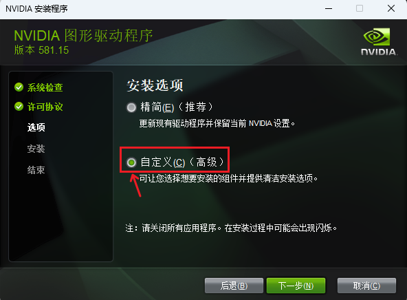

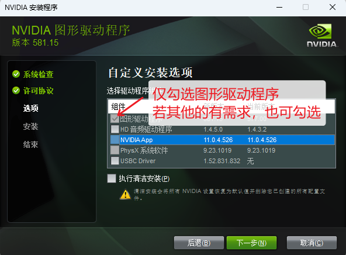

安装完成即可。

### 3.CUDA版本自查

#### 检查自己是否安装CUDA以及CUDA版本

**方式1：**

`Win+R`键打开运行，输入`cmd`,确定。

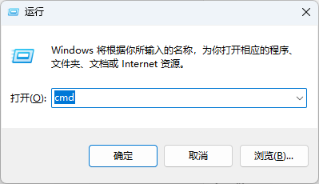

在CMD中输入命令

```
nvcc -V
```

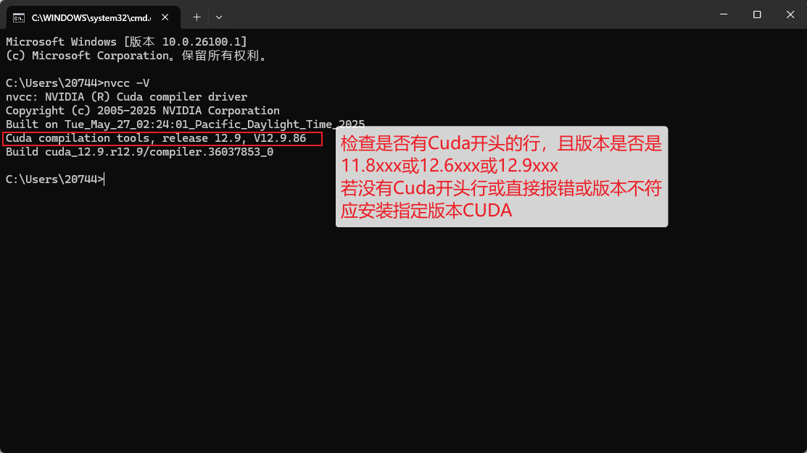

**方式2：**

打开目录“C:\Program Files\NVIDIA GPU Computing Toolkit\CUDA”，若该目录存在且里面有版本号文件夹，且版本号满足11.8xxx或12.6xxx或12.9xxx，则无需安装CUDA。

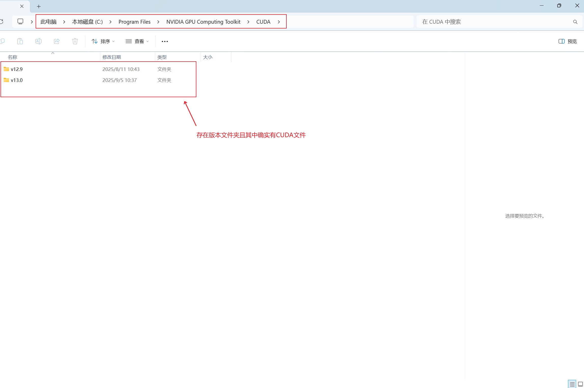

#### 安装CUDA

若不满足条件，则需要安装对应版本CUDA，推荐以下3个版本，请通过显卡驱动自查了解自己是否有安装对应版本的条件：

[CUDA 12.9](https://developer.nvidia.com/cuda-12-9-0-download-archive)

[CUDA 12.6](https://developer.nvidia.com/cuda-12-6-0-download-archive)

[CUDA 11.8](https://developer.nvidia.com/cuda-11-8-0-download-archive)

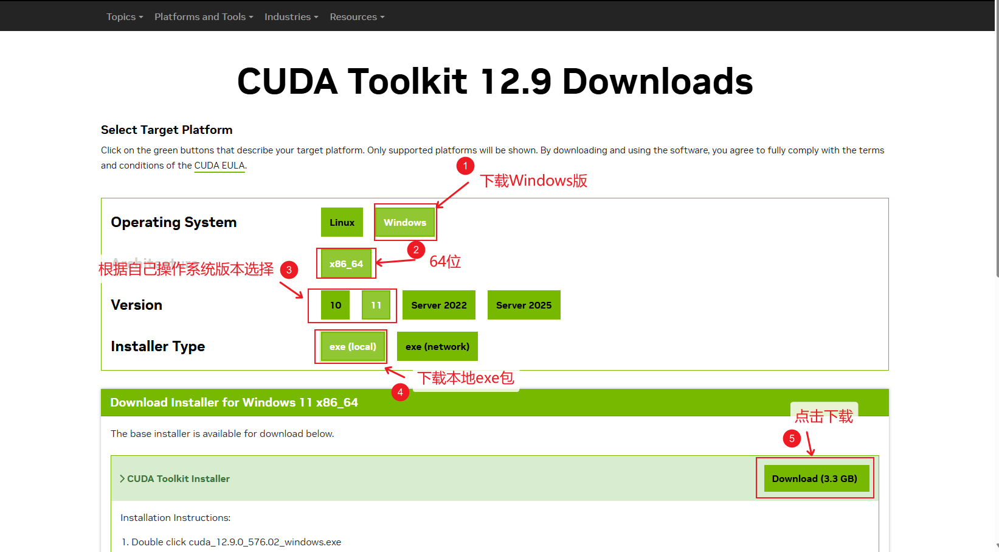

下载后打开，

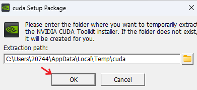

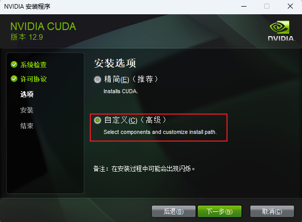

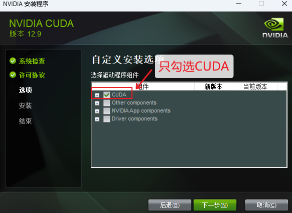

### 4.安装CUDNN

如果你安装的CUDA版本是11.8则需要的CUDNN为[cudnn-8.9.7-cuda11](https://developer.nvidia.com/downloads/compute/cudnn/secure/8.9.7/local_installers/11.x/cudnn-windows-x86_64-8.9.7.29_cuda11-archive.zip/)。

如果你安装的CUDA版本是12.6则需要的CUDNN为[cudnn-9.5.0-cuda12](https://developer.download.nvidia.com/compute/cudnn/redist/cudnn/windows-x86_64/cudnn-windows-x86_64-9.5.0.50_cuda12-archive.zip)。

如果你安装的CUDA版本是12.9则需要的CUDNN为[cudnn-9.10-cuda12](https://developer.download.nvidia.com/compute/cudnn/redist/cudnn/windows-x86_64/cudnn-windows-x86_64-9.10.0.56_cuda12-archive.zip)。

下载对应版本的压缩包，解压后得到一个文件夹，该文件夹内有三个子文件夹：bin、include、lib

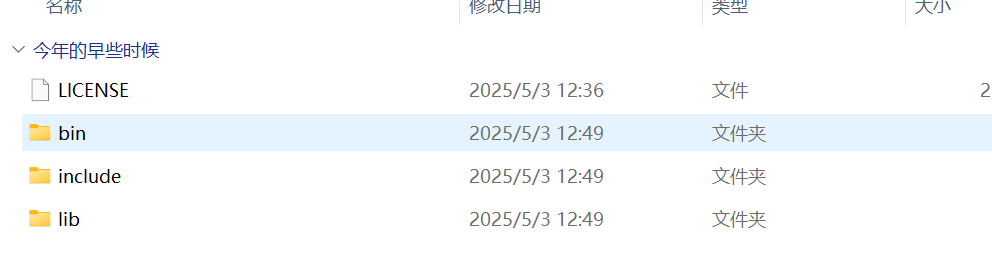

将这三个文件夹复制到CUDA的安装目录，一般在“C:\Program Files\NVIDIA GPU Computing Toolkit\CUDA\版本号”，复制完代表CUDNN安装成功。


> 至此，电脑环境的安装就完毕了，接下来需要下载与自己电脑环境相匹配的[JinChanChanTool程序运行时](https://pan.baidu.com/s/1sSuLfWJMIJUYeQ2azRGwRg?pwd=gh6g)

## 下载对应的运行时文件到软件替换掉软件根目录原有的文件

### 根据你的设备与安装的CUDA及cuDnn环境选择并下载对应的运行时文件

| 50系显卡                                                     | 40系显卡                                                     | 30系显卡                                                     | 16xx及20系显卡                                               | 10系显卡                                                     |
| ------------------------------------------------------------ | ------------------------------------------------------------ | ------------------------------------------------------------ | ------------------------------------------------------------ | ------------------------------------------------------------ |
| [cu129_cudnn910_sm120](https://github.com/XJYdemons/JinChanChanTool/releases/download/v4.5.3/cu129_cudnn910_sm120.zip) | [cu129_cudnn910_sm89](https://github.com/XJYdemons/JinChanChanTool/releases/download/v4.5.3/cu129_cudnn910_sm89.zip) | [cu129_cudnn910_sm86](https://github.com/XJYdemons/JinChanChanTool/releases/download/v4.5.3/cu129_cudnn910_sm86.zip) | [cu129_cudnn910_sm75](https://github.com/XJYdemons/JinChanChanTool/releases/download/v4.5.3/cu129_cudnn910_sm75.zip) | [cu129_cudnn910_sm61](https://github.com/XJYdemons/JinChanChanTool/releases/download/v4.5.3/cu129_cudnn910_sm61.zip) |
|                                                              | [cu126_cudnn95_sm89](https://github.com/XJYdemons/JinChanChanTool/releases/download/v4.5.3/cu126_cudnn95_sm89.zip) | [cu126_cudnn95_sm86](https://github.com/XJYdemons/JinChanChanTool/releases/download/v4.5.3/cu126_cudnn95_sm86.zip) | [cu126_cudnn95_sm75](https://github.com/XJYdemons/JinChanChanTool/releases/download/v4.5.3/cu126_cudnn95_sm75.zip) | [cu126_cudnn95_sm61](https://github.com/XJYdemons/JinChanChanTool/releases/download/v4.5.3/cu126_cudnn95_sm61.zip) |
|                                                              | [cu118_cudnn89_sm89](https://github.com/XJYdemons/JinChanChanTool/releases/download/v4.5.3/cu118_cudnn89_sm89.zip) | [cu118_cudnn89_sm86](https://github.com/XJYdemons/JinChanChanTool/releases/download/v4.5.3/cu118_cudnn89_sm86.zip) | [cu118_cudnn89_sm75](https://github.com/XJYdemons/JinChanChanTool/releases/download/v4.5.3/cu118_cudnn89_sm75.zip) | [cu118_cudnn89_sm61](https://github.com/XJYdemons/JinChanChanTool/releases/download/v4.5.3/cu118_cudnn89_sm61.zip) |

下载地址1（百度网盘）：https://pan.baidu.com/s/1sSuLfWJMIJUYeQ2azRGwRg?pwd=gh6g

下载地址2（QQ群，群文件）：954285837

下载地址3（Github）：https://github.com/XJYdemons/JinChanChanTool/releases/tag/v4.5.3

**例：**

假设我的显卡是4070，我安装的CUDA是12.9，CUDNN是9.10，所以我应该下载cu129_cudnn910_sm89.zip，解压后将其中的三个.dll文件复制到程序根目录替换掉原有的。

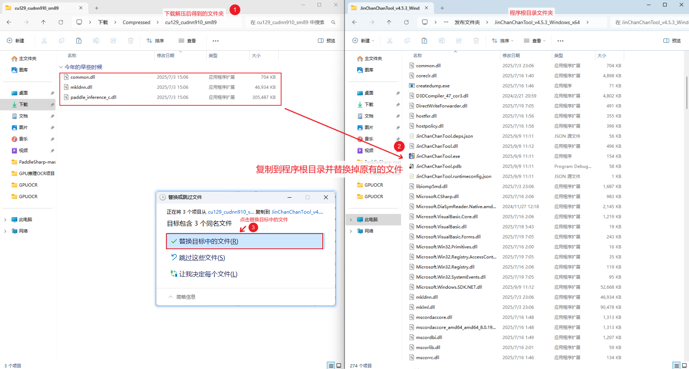

## 进入程序开启GPU推理功能

打开程序，菜单栏-设置-OCR相关-GUI推理（勾选），保存设置即可。

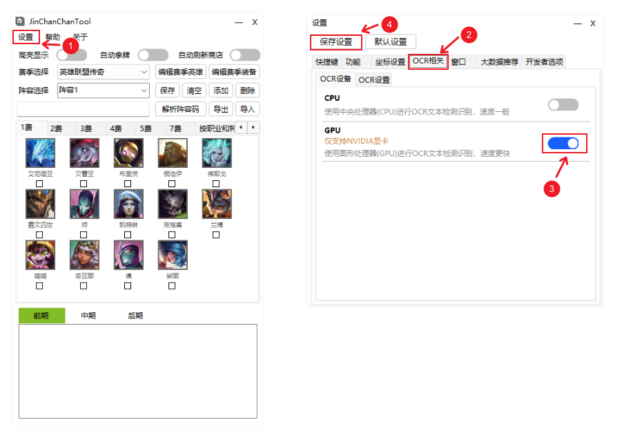